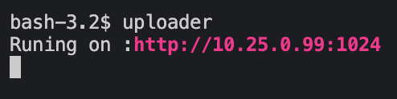
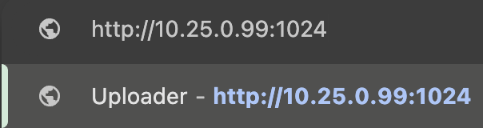

<div align="center">
	</img>
</div>

<br>
<br>
<br>

# INSTALL
```
git clone https://github.com/lignigno/uploader.git ~/uploader && \
install.sh && \
alias uploader="go run ~/uploader/main.go"
```

# USAGE

### 1) Run

<div align="center">
	</img>
</div>

### 2) Connect

<div align="center">
	</img>
</div>

### 3) And upload

<hr>

The uploaded files will be located on the path on server machine
```
$HOME/uploader/uploaded/
```